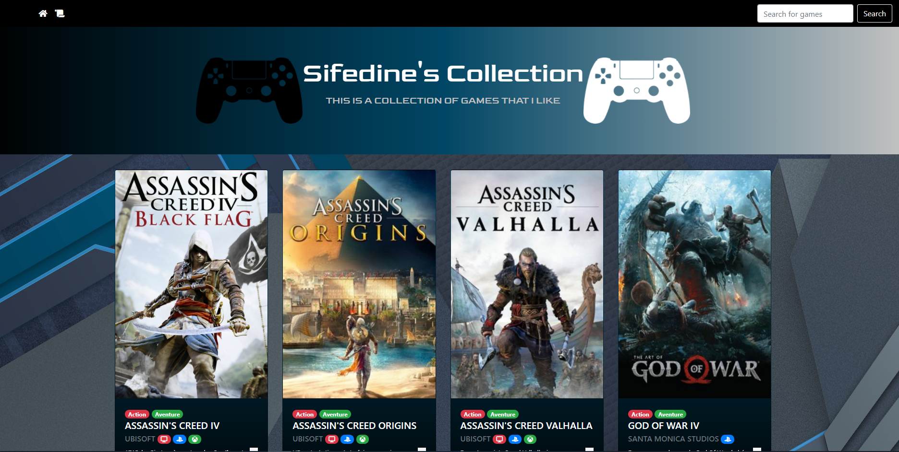

# **Collection**
by Sifedine Hajji

## What ?

This is the first javascript project which consists in creating a collection of 10 or more things (movies, series, games,...).  

## When did i work on it ?

The work was given on Thuesday 10th November and i finished it on Friday 13th.

## What does it look like ?

Here is the direct link to the site I made [Collection Library](https://sifedine-hajji.github.io/Collection/) to get a final rendering of the work.

### Screenshot:

## How I Proceeded ?

I used Bootstrap to get a visual at the cards that i would make and then i copied the html in to javascript. for the javascript i had to follow the following steps in the repository: [bxl-hopper-1-25](https://github.com/becodeorg/bxl-hopper-1-25/tree/master/The%20Field/5.leaving_the_field) to generate the rest of the javascript functionnalities as the searchBar.

## Framework
* Bootstrap was used for this project.

## License

© Hajji Sifedine
